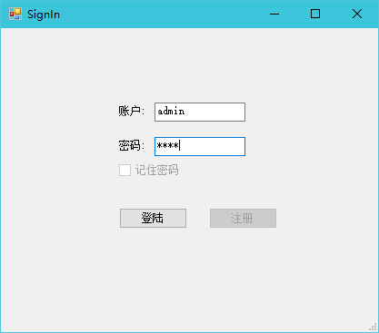
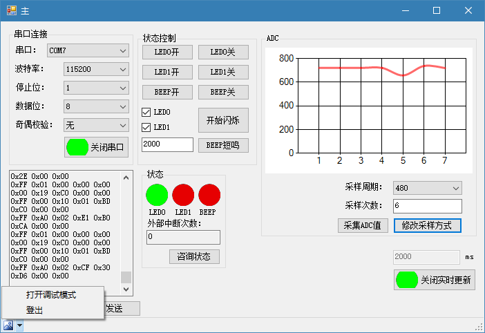
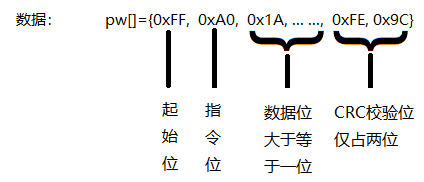
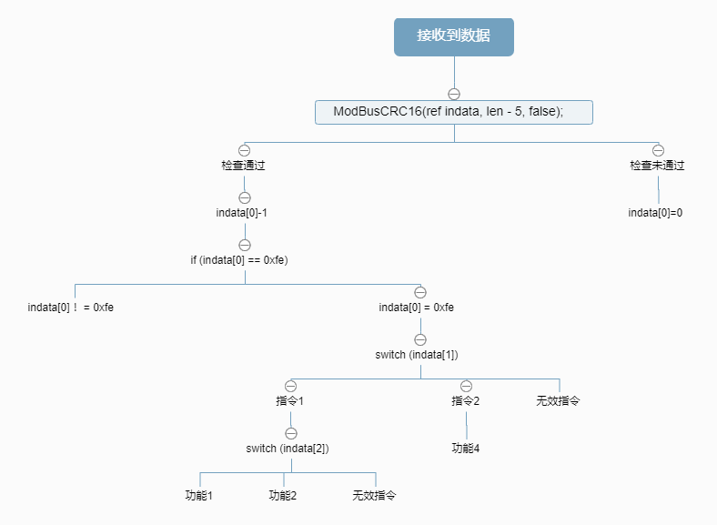

# modbus_上位机
## 本程序仅是modbus协议的简单使用，用于交流学习，仅供参考
## 简单的登陆界面
  
> 登陆账户密码均为admin
## 程序主界面
  
 > 要启用所有功能需要打开调试模式(伪 :p)
## MODBUS协议数据结构

## 上下位机协议
- ### 下位机 
|指令|数据|数据位数(字节)|功能|
|:--:|:-----:|:-----:|:-----:|
|0x00|0x00|1|关闭LED0|
|0x00|0x01|1|开启LED0|
|0x00|0x10|1|关闭LED1|
|0x00|0x11|1|开启LED1|
|0x01|0x00|1|关闭蜂鸣器|
|0x01|0x01|1|开启蜂鸣器2000ms|
|0x02|0x00|1|关闭LED0闪烁、关闭LED1闪烁|
|0x02|0x01|1|开启LED0闪烁、关闭LED1闪烁|
|0x02|0x10|1|关闭LED0闪烁、开启LED1闪烁|
|0x02|0x11|1|开启LED0闪烁、开启LED1闪烁|
|0x03|0x00|1|发送LED0、LED1和蜂鸣器状态|
|0x03|0x01|1|发送外部中断次数|
|0x04|时间|2|开启蜂鸣器对应时间|
|0xa0|占位|1|发送ADC采集到值|
|0xa1|采样周期，采样次数|4|调整ADC周期（数据[0]），变更ADC采样次数（数据[2,3]）|
- ### 上位机
|指令|数据|数据位数(字节)|功能|
|:--:|:-----:|:-----:|:-----:|
|0x00|0x00,0x00|2|显示LED0、LED1和蜂鸣器为关|
|0x00|0x01,0x01|2|显示LED0为关、LED1为开和蜂鸣器为开|
|0x00|0x10,0x00|2|显示LED0为开、LED1为关和蜂鸣器为关|
|0x00|0x11,0x01|2|显示LED0为开、LED1为开和蜂鸣器为开|
|0x01|外部中断次数|4|将外部中断次数显示在textBox1中|
|0xa0|ADC数值|2|获取ADC值并将数值更新到Chart图表|
## 数据处理方法结构图

## 其他
[下位机参考程序](SlaveComputer)是基于正点原子NANO STM32F1开发板和探索者STM32F4开发板源码改写的，仅供参考
